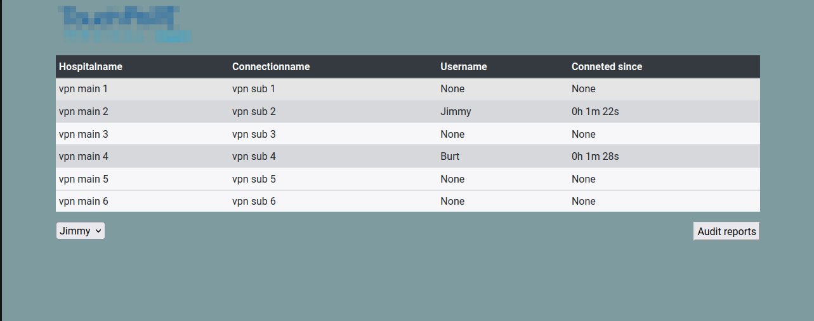

# Background



## Functionality

* Real time (connection) list:  
This is a asic socketio flask app usefull for shared lists needing real time updates.  
A specific case could be in a support team, there are clients to connect to via vpn, on would use the list to keep track of who is connected to what. Socketio takes care of real time updates of the page.
* Auditing:  
Upon unchecking a line the name of connection, user and connection time gets written to a csv file. New file on a weekly basis.
* Monitoring message relay:  
Send api post requests with json body containing monitoring info. If mail credentials were filled in (api.py) the message will be sent out to specified destination mail address.
* Authorization:  
JWT is used for logging into the graphical component (session list) but also for sending out monitoring mails.  
Session list is not secure (as the page css can be edited) but the user audits are found on a different page, where authorization is required. This is by design, the audit reports should be secure.  


# Setup

python environment
```bash
python -m venv venv
source venv/bin/activate
pip install -r requirements.txt
```

*If vscode*: Open comend palette end select just created venv as python interpreter, restart vscode to apply.  
Hit the run button (from app.py)

Edit app.py and api.py variables:
* app.py  
`app.config["SECRET_KEY"] = 'secret'`
* api.py  
`hc_user = "promon"`  
`hc_pw = '12345'`  
`mailTo = 'mail@mail.com'`  
`mailFrom = mailUser = 'mail@mail.com'`  
`mailPw = 'mailPassword'`  
`mailServer = 'smtp.office365.com'`  
`mailPort = '587'`  

Edit the config/* files:
* sessions.csv: comma seperate the main and sub connection names, like 'vpn main 1;vpn sub 1'
* users.txt: fill with app usernames.

# (Azure) Deployment  examples:

Two deployment examples, in the first we zip the source files and deploy to an Azure app service.  
The second is more generic, we first make a container, then deploy as an app service.  
In both the location of the audit reports is configured as an Azure share, to persist data across redeployments.

## Azure app service (Zip deployment):

**prerequisites**: azure resource group, app plan, sotrage account, azure file share (and access token)

```powershell
# create app
az webapp create --name vpn-sessions --resource-group ResGrpName --plan PlanName --runtime PYTHON:3.9
# edit config, zip deploy not possible by default
az webapp config appsettings set --resource-group ResGrpName --name vpn-sessions --settings SCM_DO_BUILD_DURING_DEPLOYMENT=true 
# set app start command
az webapp config set --resource-group ResGrpName --name vpn-sessions --startup-file 'gunicorn --bind=0.0.0.0 --timeout 30 -k geventwebsocket.gunicorn.workers.GeventWebSocketWorker -w 1 app:app'
# link Azure file share
az webapp config storage-account add --resource-group ResGrpName --name vpn-sessions --custom-id auditreports --storage-type AzureFiles --share-name auditreports --account-name azfileacct --access-key '[token]' --mount-path '/audit_export'
# deploy
az webapp deploy --name vpn-sessions --resource-group ResGrpName --src-path vpn-sessions.zip
```
## Azure  app service (ACR container):

**Prerequisite**: Same as previous, in addition: Azure Container Registry is created.

See [Docker-compose.yml](Docker-compose.yml), [Dockerfile](Dockerfile) and [gunicorn.sh](gunicorn.sh) for docker setup.

```powershell
# first build locally
docker compose build
# add image to ACR
az login
az acr login --name someacr.azurecr.io
docker tag localConainerName someacr.azurecr.io/vpn_sessions
docker compose push
# deploy the ACR container as Azure app service
az webapp create --name vpn-sessions --resource-group ResGrpName --plan PlanName --deployment-container-image-name 'someacr.azurecr.io/vpn_sessions'
# Link the Azure file share
az webapp config storage-account add --resource-group ResGrpName --name vpn-sessions --custom-id auditreports --storage-type AzureFiles --share-name auditreports --account-name azfileacct --access-key '[token]' --mount-path '/audit_export'
```


# API usage

- get token
```bash
curl --location --request POST 'http://127.0.0.1:5000/api/loginUser' \
--header 'Authorization: Basic cHJvbW9uOjEyMzQ1'
```
- test token
```bash
curl --location --request GET 'http://127.0.0.1:5000/api/test' \
--header 'x-access-tokens: [token]'
```
- send monitoring message
```bash
curl --location --request POST 'http://127.0.0.1:5000/api/placeMessage' \
--header 'x-access-tokens: [token]' \
--header 'Content-Type: application/json' \
--data-raw '{
    "message" : "hello"
}'
```

# Running examples

* SockerIO list updating:

    
* Authorization and audit report fetching:

    
* Relay monitoring messages, send mail:

    

